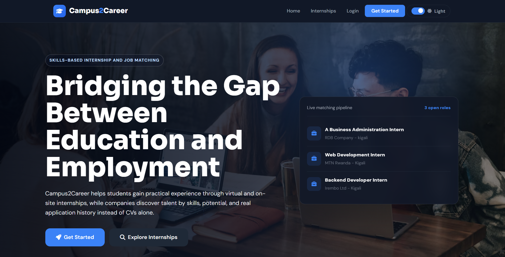
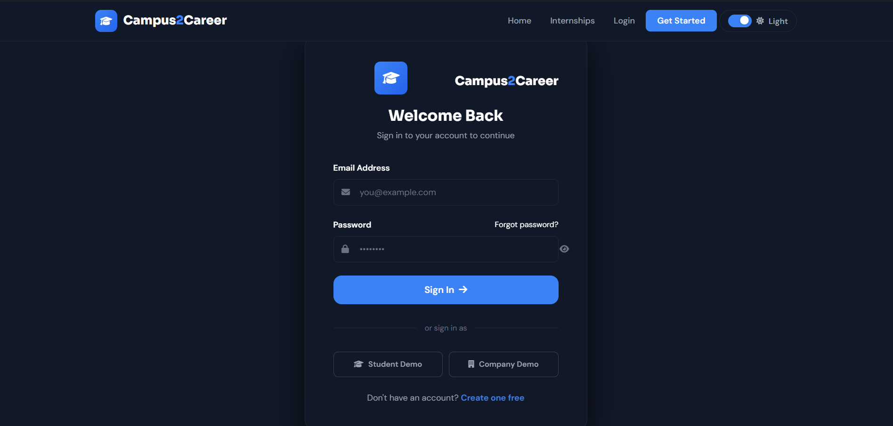
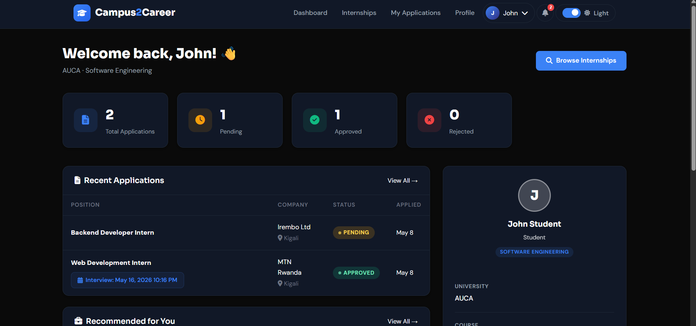
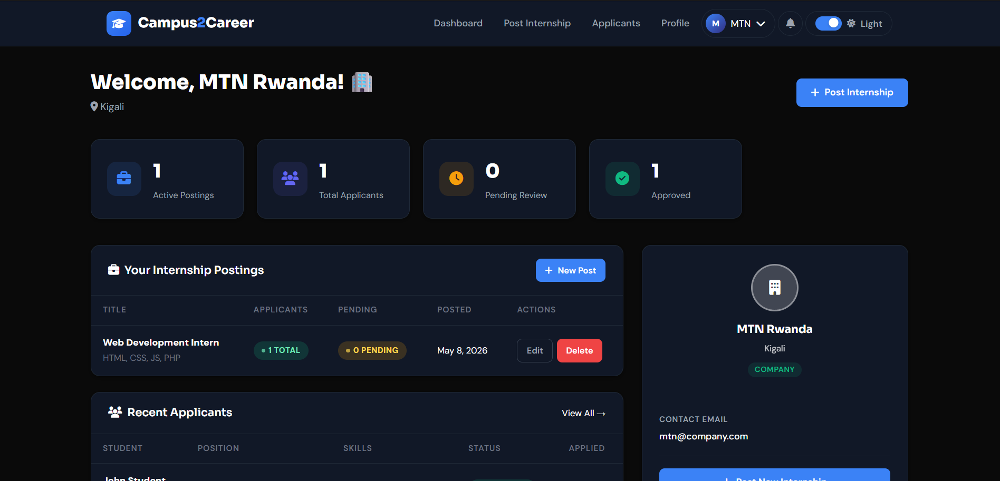
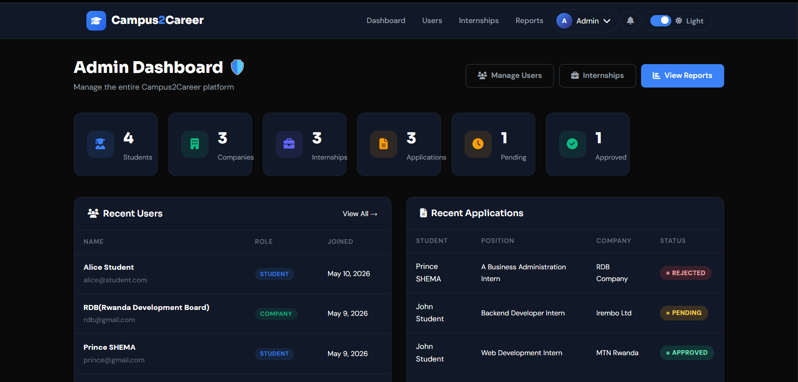

# Campus2Career 🎓

> Internship and Job Matching System — Bridging Education and Employment

A modern web-based Internship and Job Matching System designed to connect students and recent graduates with companies offering internship opportunities. Built with PHP, MySQL, and a skills-first approach to recruitment.


---

##  Table of Contents

- [Overview](#overview)
- [Problem Statement](#problem-statement)
- [Features](#features)
- [System Workflow](#system-workflow)
- [Skill Matching Engine](#skill-matching-engine)
- [Screenshots](#screenshots)
- [Technology Stack](#technology-stack)
- [Architecture](#architecture)
- [Database Design](#database-design)
- [Installation & Setup](#installation--setup)
- [Project Structure](#project-structure)
- [Security](#security)
- [API Reference](#api-reference)
- [Contributing](#contributing)
- [License](#license)

---

## Overview

Campus2Career addresses the critical disconnect between academic learning and industry experience. The platform enables:

- **Students & Graduates** – Gain practical exposure through virtual and on-site internships
- **Companies** – Discover and recruit skilled young talent based on demonstrated competencies
- **Universities** – Improve graduate employability and track industry engagement outcomes

The system moves beyond traditional CV-based screening by matching candidates to roles using **skills-based algorithms**, providing a fairer, more accurate recruitment process.

---

## Problem Statement

Many graduates possess strong theoretical knowledge but struggle to transition into the workforce due to:

- **Lack of practical experience** – No industry exposure despite academic excellence
- **Ineffective CV screening** – Traditional hiring rewards presentation over actual ability
- **Limited internship access** – Scarce, manual placement processes at scale
- **Skills gap mismatch** – Employers need demonstrable skills (PHP, MySQL, teamwork, delivery readiness)
- **Poor tracking** – Universities lack visibility into placement outcomes and internship quality

Campus2Career solves these problems with an end-to-end platform for posting, applying, reviewing, and hiring — all centered around **verified skills and profiles**.

---

## Features

###  Student Portal

- **User Registration & Authentication** – Secure signup/login with role-based access
- **Profile Management** – Complete academic and personal information
- **CV & Certificate Upload** – Document management with secure file storage
- **Internship Discovery** – Browse, search, and filter opportunities
- **Application System** – One-click apply with real-time status tracking
- **Skill-Based Matching** – Automatic match percentage shown for each role
- **Interview Scheduling** – View interview details, locations, and notes
- **Email Notifications** – Instant updates on application status changes
- **Dashboard Analytics** – Track applications, match scores, and profile views

###  Company Portal

- **Company Profile** – Brand presence with description, website, and location
- **Internship Posting** – Create detailed job listings with responsibilities, expectations, and requirements
- **Applicant Management** – View all applications with match scores and profile data
- **Profile Review** – Side-by-side comparison of student skills, CVs, certificates, and match percentages
- **Approval/Rejection Workflow** – decisions with structured feedback
- **Interview Scheduling** – Set date, time, location, and notes for candidates
- **Email Alerts** – Notify candidates automatically on status changes
- **Analytics Dashboard** – Track posted internships, applicant counts, and hiring metrics

###  Admin Portal

- **User Management** – Approve, disable, or remove users across all roles
- **Platform Oversight** – Monitor registrations, activity, and system health
- **Internship Moderation** – Review and manage posted opportunities
- **Report Generation** – Export analytics on placements, skills demand, and graduate outcomes
- **System Configuration** – Manage email settings, database schema, and application settings
- **Dashboard Analytics** – High-level metrics on students, companies, internships, and applications

###  Core System Features

- **Skill Matching Algorithm** – Keyword-based matching with percentage scores and labels (Excellent/Good/Partial/Low/No Match)
- **Real-Time Notifications** – Instant alerts for application updates and interview invites
- **Secure File Uploads** – CV and certificate storage with validation
- **Responsive Design** – Fully accessible on desktop, tablet, and mobile
- **Email Service** – PHPMailer integration with fallback to PHP mail()
- **Role-Based Access Control** – Strict separation between student, company, and admin functions
- **Audit Trails** – Application history, status changes, and timestamps

---

## System Workflow

### Student Journey

1. **Register** → Create account with email and password
2. **Complete Profile** → Add university, course, skills, upload CV and certificates
3. **Browse Internships** → View listings with match percentages calculated automatically
4. **Apply** → Submit application with one click
5. **Track Status** → Monitor application in dashboard (pending/approved/rejected)
6. **Receive Notifications** → Email alerts for approvals, rejections, and interview invites
7. **Interview** → View scheduled details and attend
8. **Get Hired** → Complete internship and gain experience

### Company Journey

1. **Register** → Create company account
2. **Build Profile** → Add company name, description, location, website
3. **Post Internship** → Create detailed role with title, description, responsibilities, expectations, and requirements
4. **Receive Applications** → Get notified when students apply
5. **Review Candidates** → View profiles, match scores, CVs, and certificates
6. **Make Decision** → Approve or reject with optional feedback
7. **Schedule Interview** → Set date, time, and location if applicable
8. **Communicate** → Automatic email notifications at each stage

### Admin Journey

1. **Secure Login** → Access admin dashboard
2. **Monitor Platform** → View statistics and recent activity
3. **Manage Users** → Enable/disable accounts, review registrations
4. **Manage Internships** → Remove inappropriate or expired postings
5. **Generate Reports** → Export data for analysis and presentations
6. **System Settings** → Configure email, manage database schema

---

## Skill Matching Engine

The core intelligence of Campus2Career is the **SkillMatcher** class, which calculates how well a student's skills align with internship requirements.

### How It Works

```php
SkillMatcher::match($studentSkills, $requirements);
```

- Tokenizes both skill strings by spaces, commas, semicolons, slashes, and pipes
- Finds intersection of keywords
- Calculates percentage: `(matched keywords / total requirement keywords) × 100`

### Match Labels

| Percentage | Label        | Color    |
|------------|--------------|----------|
| 80–100%    | Excellent    | 🟢 Green |
| 60–79%     | Good         | 🔵 Blue  |
| 40–59%     | Partial      | 🟡 Yellow|
| 20–39%     | Low          | 🔴 Red   |
| 0–19%      | No Match     | 🔴 Red   |

### Example

```
Student Skills: "php, mysql, javascript, html, css, teamwork"
Requirements:  "php, mysql, laravel, api development"

Matched: php, mysql (2 out of 4)
Match: 50% → Partial Match
```

---

## Screenshots

###  Landing Page



###  Login Page



### Student Dashboard



###  Company Dashboard



###  Admin Dashboard



###  Internship Details Page


###  Applicant Profile Review


### My Applications Page


---

## Technology Stack

### Backend

- **PHP 7.4+** – Server-side logic with MVC pattern
- **PDO (PHP Data Objects)** – Secure database access with prepared statements
- **PHPMailer** – Professional email delivery with SMTP support

### Database

- **MySQL 8.0+** – Relational database for structured data storage
- **XAMPP** – Local development environment (Apache, MySQL, PHP)

### Frontend

- **HTML5 & CSS3** – Semantic markup and modern styling
- **JavaScript (ES6+)** – Client-side interactivity and dynamic updates
- **Font Awesome 6** – Icon library for UI elements

### Tools & Utilities

- **Git & GitHub** – Version control and collaboration
- **Composer** (optional) – Dependency management
- **Chart.js** – Data visualization for dashboards

---

## Architecture

### Design Pattern: MVC (Model-View-Controller)

```
┌─────────────────────────────────────────────────────────────┐
│                         Frontend (Browser)                 │
├─────────────────────────────────────────────────────────────┤
│                         index.php (Router)                 │
├───────────────┬─────────────────────┬───────────────────────┤
│     Views     │     Controllers     │      Models           │
│ (User Interface)│ (Business Logic)  │ (Data Layer)          │
├───────────────┴─────────────────────┴───────────────────────┤
│                   config/database.php (PDO)                │
├─────────────────────────────────────────────────────────────┤
│                     MySQL Database                          │
└─────────────────────────────────────────────────────────────┘
```

### Key Components

- **Models** – Database entities (Student, Company, Internship, Application, etc.)
- **Views** – HTML templates with embedded PHP for dynamic content
- **Controllers** – Handle HTTP requests, validate input, orchestrate models
- **Config** – Database connection, schema management, environment constants
- **Includes** – Reusable components (header, footer, authentication)
- **Assets** – Static files (CSS, JavaScript, images)
- **Uploads** – Secure file storage for CVs and certificates

---

## Database Design

### Entity Relationship Diagram

```
users (role: student|company|admin)
  │
  ├─→ students (profile, skills, cv_file)
  │      └─→ student_certificates (many)
  │      └─→ applications (many)
  │
  ├─→ companies (profile, description, website)
  │      └─→ internships (many)
  │
  └─→ admins (profile)

internships (posted by companies)
  └─→ applications (from students)
         └─→ interview details (date, location, notes)
```

### Core Tables

| Table | Purpose | Key Fields |
|-------|---------|------------|
| `users` | Authentication & role base | `user_id`, `email`, `password`, `role` |
| `students` | Student profiles | `student_id`, `user_id`, `university`, `course`, `skills`, `cv_file` |
| `companies` | Company profiles | `company_id`, `user_id`, `company_name`, `location`, `description` |
| `internships` | Job postings | `internship_id`, `company_id`, `title`, `description`, `requirements` |
| `applications` | Applications tracking | `application_id`, `student_id`, `internship_id`, `status`, `interview_date` |
| `student_certificates` | Certificate files | `certificate_id`, `student_id`, `file_name` |

### Schema Management

The database schema is managed through:
- **`config/schema.sql`** – Initial database creation with sample data
- **`config/database.php`** – Contains `ensureApplicationSchema()` function that runs `ALTER TABLE` migrations on every connection to keep schema up-to-date

---

## Installation & Setup

### Prerequisites

- PHP 7.4 or higher
- MySQL 8.0 or higher
- XAMPP, WAMP, MAMP, or equivalent LAMP stack
- Git (optional)

### Step-by-Step Installation

1. **Clone or Download the Repository**

   ```bash
   git clone https://github.com/yourusername/campus2career.git
   cd campus2career
   ```

   Or download the ZIP and extract to your web server directory (e.g., `htdocs/campus2career` for XAMPP).

2. **Set Up Database**

   - Start Apache and MySQL in XAMPP/WAMP
   - Open phpMyAdmin at `http://localhost/phpmyadmin`
   - Create a new database named `campus2career`
   - Import `config/schema.sql` into the database

   Alternatively, the application will auto-create tables on first run via `ensureApplicationSchema()`.

3. **Configure Database Connection**

   Edit `config/database.php` if needed:

   ```php
   define('DB_HOST', 'localhost');
   define('DB_NAME', 'campus2career');
   define('DB_USER', 'root');
   define('DB_PASS', '');  // Change if you have a MySQL password
   ```

4. **Set Up File Permissions**

   Ensure the `uploads/` directory is writable:

   ```bash
   chmod 755 uploads/
   chmod 755 uploads/cv/
   chmod 755 uploads/certificates/
   ```

   On Windows XAMPP, this is typically already configured.

5. **Access the Application**

   Open your browser and navigate to:

   ```
   http://localhost/campus2career/
   ```

   Or if using a virtual host:

   ```
   http://campus2career.test/
   ```

6. **Initialize Sample Data** (Optional)

   Run `setup.php` to create sample users:

   ```
   http://localhost/campus2career/setup.php
   ```

   **Sample Credentials:**

   | Role     | Email                | Password  |
   |----------|----------------------|-----------|
   | Admin    | admin@c2c.com        | admin123  |
   | Student  | john@student.com     | 123456    |
   | Student  | alice@student.com    | 123456    |
   | Company  | mtn@company.com      | 123456    |
   | Company  | irembo@company.com   | 123456    |

7. **Configure Email (Optional but Recommended)**

   For production use, configure SMTP settings via environment variables or directly in `EmailService.php`:

   ```php
   SMTP_HOST=smtp.gmail.com
   SMTP_PORT=587
   SMTP_SECURE=tls
   SMTP_USER=your-email@gmail.com
   SMTP_PASS=your-app-password
   ```

   Without SMTP, the system falls back to PHP's `mail()` function (requires local mail server configuration).

8. **Secure Your Installation**

   - Rename or remove `setup.php` after initial setup
   - Change default passwords immediately
   - Use HTTPS in production (update `baseUrl()` in `EmailService.php`)
   - Keep XAMPP/Apache updated
   - Review `.gitignore` to ensure sensitive files are excluded

### Troubleshooting

| Issue | Solution |
|-------|----------|
| Database connection error | Verify MySQL is running, check credentials in `database.php` |
| File upload fails | Ensure `uploads/` directory exists and is writable |
| Emails not sending | Configure SMTP or verify local mail server (sendmail, postfix) |
| 404 on subpages | Check Apache `mod_rewrite` enabled or use correct URL paths |
| White screen | Enable PHP error reporting in `php.ini` (`display_errors = On`) |

---

## Project Structure

```
campus2career/
│
├── config/
│   ├── database.php        # PDO connection + schema migrations
│   └── schema.sql          # Full database schema + sample data
│
├── controllers/
│   ├── auth_controller.php    # Login, registration, logout
│   ├── internship_controller.php # Browse, post, apply, manage
│   ├── admin_controller.php   # Admin panel actions
│   └── notifications_ajax.php # Real-time notification polling
│
├── models/
│   ├── SkillMatcher.php      # Skills matching algorithm
│   ├── EmailService.php      # Email delivery (PHPMailer + fallback)
│   └── Notification.php      # Notification data handling
│
├── views/
│   ├── student/          # Student dashboard, profile, internships, applications
│   ├── company/          # Company dashboard, post internship, applicants
│   ├── admin/            # Admin dashboard, users, reports, internships
│   └── public/           # Public internship listings (no login required)
│
├── includes/
│   ├── auth.php          # Session management, role checks, helpers
│   ├── header.php        # HTML head, navigation bar
│   └── footer.php        # Footer, scripts, closing tags
│
├── assets/
│   ├── css/
│   │   └── style.css     # All stylesheets (responsive)
│   └── js/
│       └── main.js       # Client-side interactions
│
├── uploads/
│   ├── cv/               # Uploaded CV files (protected by .htaccess)
│   └── certificates/     # Uploaded certificate files
│
├── index.php             # Landing page with stats and CTA
├── login.php             # Login form
├── register.php          # Registration form (role selection: student/company)
├── setup.php             # Initialize sample data (remove in production)
│
├── README.md             # This file
└── .gitignore            # Excludes uploads, config, and sensitive files
```

---

## Security

### Implemented Measures

- **Password Hashing** – `password_hash()` with bcrypt (PASSWORD_DEFAULT)
- **Prepared Statements** – PDO prevents SQL injection across all queries
- **Input Validation** – Server-side sanitization of all user inputs
- **Session Security** – Regenerated session IDs on login, strict role checks
- **File Upload Restrictions** – Only PDF files allowed for CVs/certificates, size limits enforced
- **XSS Prevention** – `htmlspecialchars()` on all output data
- **CSRF Protection** – Token-based validation on sensitive forms (where implemented)
- **Access Control** – Role-based middleware prevents unauthorized page access


---

## API Reference

### Internal PHP Classes

#### `SkillMatcher`

```php
SkillMatcher::match(string $studentSkills, string $requirements): array
// Returns: ['percent' => int, 'matched' => array, 'total' => int]

SkillMatcher::label(int $percent): string
// Returns: 'Excellent Match' | 'Good Match' | 'Partial Match' | 'Low Match' | 'No Match'

SkillMatcher::color(int $percent): string
// Returns: Hex color code (#10B981, #3B82F6, #F59E0B, #EF4444)
```

#### `EmailService`

```php
$email = new EmailService();

$email->sendApproval($to, $name, $internshipTitle, $companyName): bool
$email->sendRejection($to, $name, $internshipTitle, $companyName): bool
$email->sendInterviewScheduled($to, $name, $title, $company, $dateTime, $location, $notes): bool
$email->sendNewApplication($to, $companyName, $studentName, $internshipTitle): bool
```

#### `FileUploader`

```php
$uploader = new FileUploader('cv');
$uploader->save($_FILES['cv'], $studentId);
// Handles secure file naming, validation, and storage
```

### AJAX Endpoints

- `controllers/notifications_ajax.php` – Polls for new notifications (returns JSON)


---

## License

This project is licensed under the **MIT License** – see the [LICENSE](LICENSE) file for details.

You are free to:
- Use, copy, modify, merge, publish, distribute, sublicense, and/or sell copies
- Use for commercial or non-commercial purposes

Attribution is appreciated but not required.

---

## Acknowledgments

- Built with  for students, universities, and forward-thinking companies
- Inspired by the need for skills-first recruitment in emerging markets
- Icons by [Font Awesome](https://fontawesome.com/)
- Hosting suggestions: XAMPP for local dev, AWS EC2/Azure/LAMP for production

---

##  Contact

**Developer:** Vivance SHYAKA  
**Institution:** Adventist University of Central Africa (AUCA)  
**Year:** 2026

For questions, partnerships, or support, feel free to reach out:

-  Email: [shyakavivance1@gmail.com](mailto:shyakavivance1@gmail.com)
-  GitHub: [Vivance-Shyaka/Campus2Career](https://github.com/Vivance-Shyaka/Campus2Career)
-  Website: [campus2career.com](https://campus2career.com)

---

<p align="center">
  <strong>Ready to bridge the gap between campus and career?</strong><br>
  <a href="register.php">Create Account</a> · <a href="views/public/internships.php">Browse Internships</a>
  <br><br>
  <sub>Last updated: 2026 • Campus2Career v1.0.0</sub>
</p>
